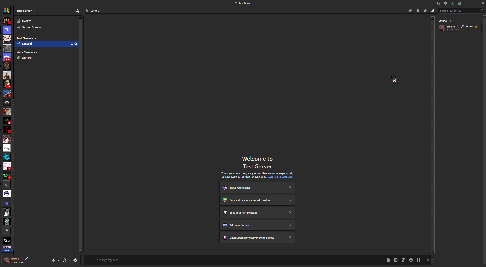
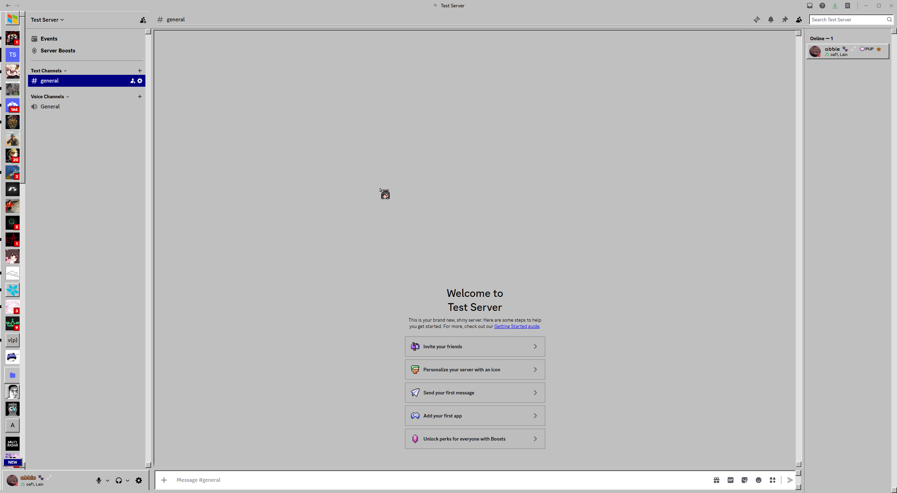

Win98
A Windows 98 theme for Discord. Square icons, bevelled everything, no rounded corners. Light and dark in one file — it follows your Discord appearance setting.

Win98 Themes Dark/Light

Install
Equicord / Vencord

Download Win98.theme.css
Settings → Themes → Open Themes Folder
Drop the file in, then tick it in the themes list
BetterDiscord — same idea, drop it in your themes folder.

by abbienull
